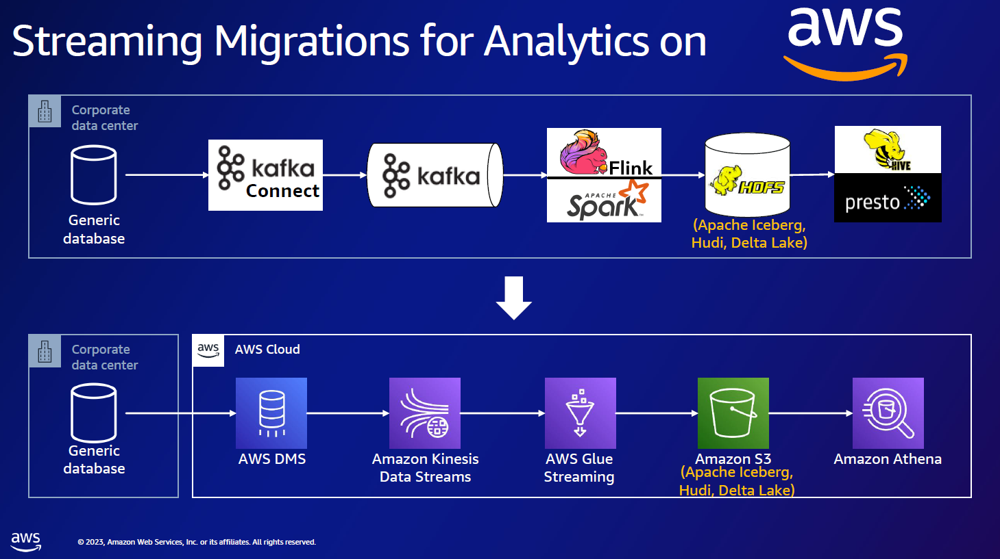

# aws-rds-dms-kinesis-iceberg
aws cdc pipline


### CDC 파이프라인 구축

S3로 데이터 레이크를 관리하지만, 변경 데이터 처리의 한계를 맛보고 구현 진행함.


### 아키텍쳐 (AWS Submit 참고)


### 작업 간 체크
1. RDS Binlog 
- CDC 를 하려면 Binlog가 활성화 되어있어야함 [관련 Docs](https://docs.aws.amazon.com/ko_kr/dms/latest/userguide/CHAP_Source.MySQL.html)   
2. DMS 를 사용할때 public zone 에 진행되는게 아니고, Severless 솔루션을 쓴다면 VPC endpoint 생성해둬야함 [관련 Docs](https://docs.aws.amazon.com/ko_kr/dms/latest/userguide/CHAP_VPC_Endpoints.html)   
3. 당연하지만 SecretManager 도 열어둬야함   
4. kinesis datastream 부터 하나씩 확인 필요 (kinesis 데이터 조회 간 LATEST 말고 TIMESTAMP 로 찍는게 더 남, LASTEST 는 들어오고 있는 실시간 데이터만 보여서 수동으론 보기 어려움)

<h3>kinesis datastream cdc 데이터 포맷 참고</h3>

```json
{
	"data":	{
		"temp" : temp
	},
	"metadata":	{
		"timestamp":	"2024-09-05T05:11:52.893007Z",
		"record-type":	"data",
		"operation":	"delete",
		"partition-key-type":	"schema-table",
		"schema-name":	"{}",
		"table-name":	"{}",
		"transaction-id":	5145370820848
	}
}
```


### Issue 
1. DMS Serverless permissions issues [관련 Docs](https://docs.aws.amazon.com/ko_kr/dms/latest/userguide/security-iam-awsmanpol.html)
- DMS Serverless 를 통하여 RDS to Kinesis cdc를 구축하였는데, cloudWatch Log 생성이 안됨
- 권한 에러가 자주 표시   
-> Severless 전용 iam 과 VPC Endpoint 생성으로 해결

2. Glue receiving data from kinesis DataStream and missing some columns in schema inference
- 파악중이나, 스키마 추론 샘플링 비율을 높이면 약간 개선됨 

<h3>샘플링 조절 참고</h3>

```python
kds_df = glueContext.create_data_frame.from_options(
    connection_type="kinesis",
    connection_options={
        "typeOfData": "kinesis",
        "streamARN": "~",
        "classification": "json",
        "startingPosition": "TRIM_HORIZON",
        "inferSchema": "true",
    },
    transformation_ctx="kds_df",
    additional_options={"samplingRatio": 0.15}
)

```
- stream 데이터는 null을 제외하고 갖고오기때문에 일부 컬럼의 누락이 있을 수 있음, temp_view 를 만들때 있는 컬럼만 선택하게 하거나, 누락 컬럼을 추가하는 방식 필요 (*이번 개발 코드에선 두번째 방식 이용*)

3. Glue version4
- 몇몇 Spark API 사용 간 호환되지 않는 것들이 발견되어 3.0 버전 사용 

### 참고자료 
1. [실시간 CDC 데이터처리! AWS Submmit](https://aws.amazon.com/ko/blogs/tech/cdc-data-pipeline-from-db-to-opensearch-service/)